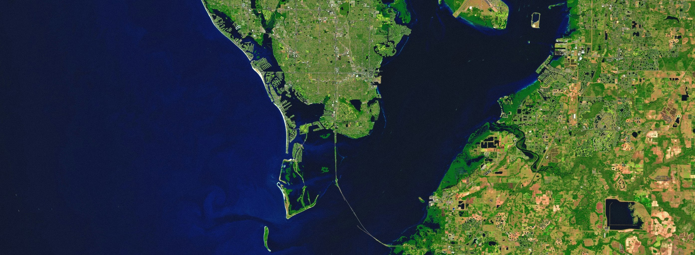

<!-- GitHub Profile README -->

<!-- Banner -->

<!-- Intro -->
<h1 align="center">Hi there! 👋 I'm Krishnagopal Halder</h1>

🛰️ Geospatial Data Scientist | 🌾 AI for Agriculture | 🌍 Remote Sensing & Earth Observation Enthusiast  

Currently a Research Scientist at <strong>ZALF, Germany</strong> 🇩🇪,  
I'm passionate about combining geospatial analytics, AI/ML, and cloud computing to address global sustainability challenges — especially in agriculture, climate, and food systems.

🛠️ Working on <a href="https://synpaim.wordpress.com/news/" target="_blank">SynPAI</a>, <a href="https://www.agml.org/" target="_blank">AgML</a>, and <a href="#">LL SYSTAIN</a> projects  
💡 Google Earth Engine | PyTorch | Remote Sensing | ML | Environmental Intelligence  
🧠 Occasional blog writer on <a href="https://medium.com/@geonextgis" target="_blank">Medium</a>  

---

## 🔬 Ongoing Projects
- 🌱 **LL SYSTAIN** – Systemic Sustainability: Biodiversity, Climate, and Agriculture Intersections  
- 🧠 **SynPAI** – Synergizing Process-based and ML Models for Crop Yield Prediction  
- 🌾 **AgML** – Machine Learning for Agricultural Modeling  

---

## 📊 GitHub Stats

  
  

<!-- Snake animation -->
<picture>
  <source media="(prefers-color-scheme: dark)" srcset="https://raw.githubusercontent.com/geonextgis/geonextgis/output/github-snake-dark.svg" />
  <source media="(prefers-color-scheme: light)" srcset="https://raw.githubusercontent.com/geonextgis/geonextgis/output/github-snake.svg" />
  

    
  

</picture>

---

## 💻 Tech Stack

 
 
 

🧭 Also proficient in: Google Earth Engine, ArcGIS, QGIS, Scikit-learn, Remote Sensing Analysis, Machine Learning, Deep Learning, Feature Engineering

---

## 🏆 Achievements

- 🥇 **GATE 2024 (Geomatics Engineering)** – All India Rank **36**
- 🏅 Ranked in **Top 0.01%** in WB Higher Secondary Board (479/500)
- 📚 4x First-author / co-author in Q1-ranked peer-reviewed journals  
  *(Scientific Reports, Environmental Sciences Europe, GNH Risk)*

---

## 📚 Latest Publications

- 🌍 Halder et al., (2025): *Improving Landslide Susceptibility via Meta-Learning*. Scientific Reports [🔗](https://www.nature.com/articles/s41598-025-87587-3)  
- 🚜 Halder et al., (2024): *SAR-driven flood inventory using ML*. GNH Risk [🔗](https://doi.org/10.1080/19475705.2024.2409202)  
- 💧 Halder et al., (2024): *Groundwater Mapping in Eastern India*. Env. Sci. Europe [🔗](https://link.springer.com/article/10.1186/s12302-024-00981-y)  

---

## 🌐 Let's Connect

  
  &nbsp;
  
  &nbsp;
  
  &nbsp;
  

  

